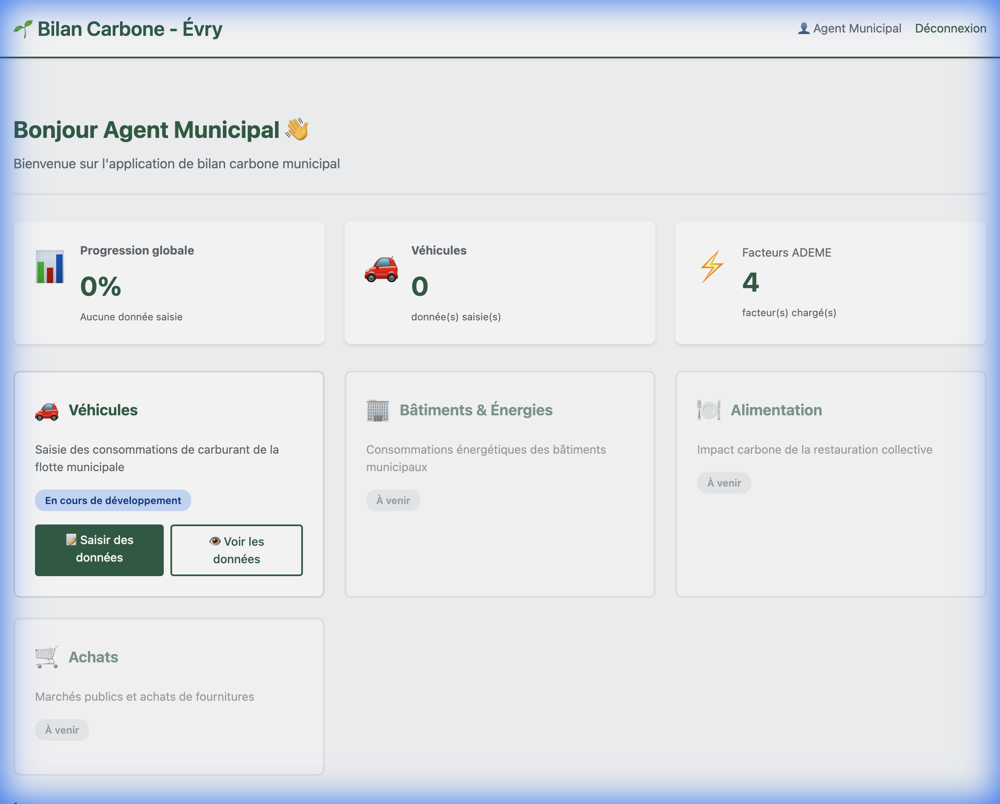
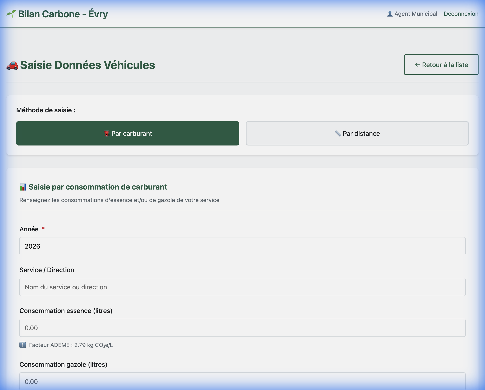
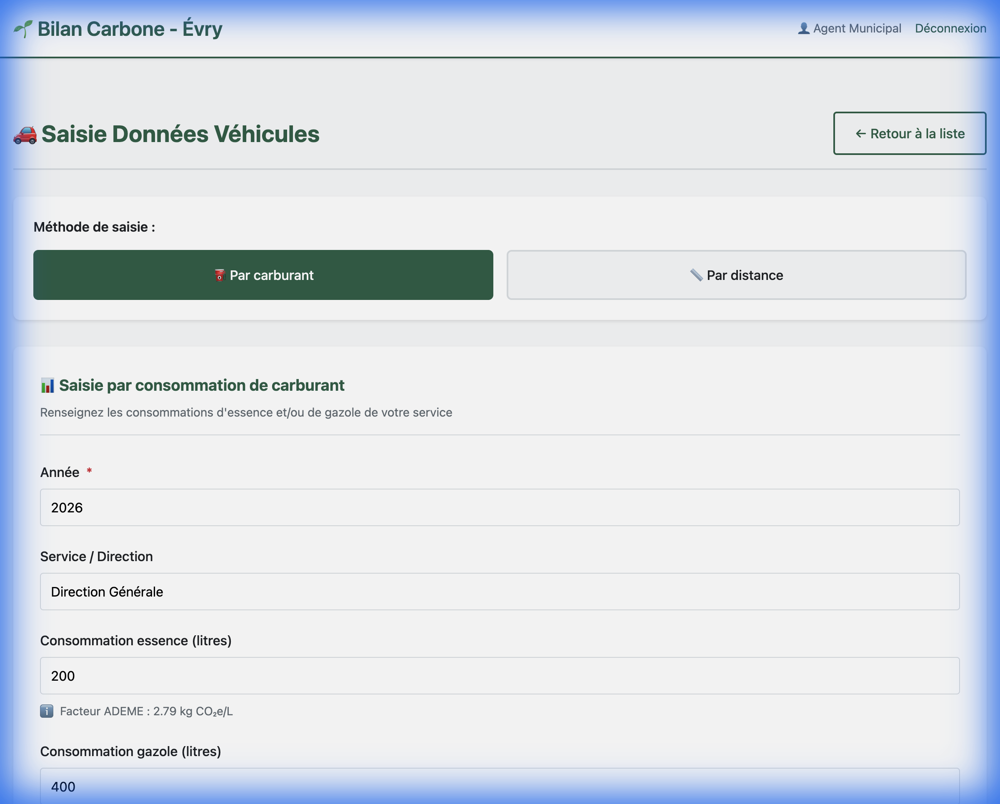
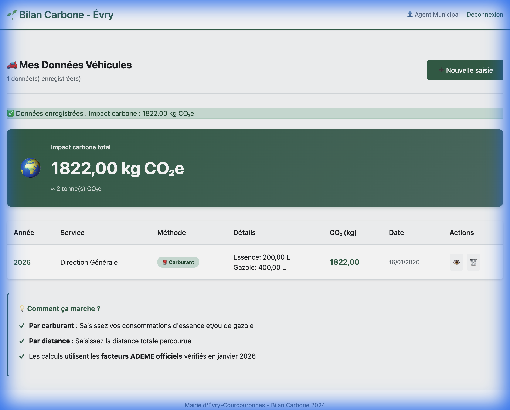
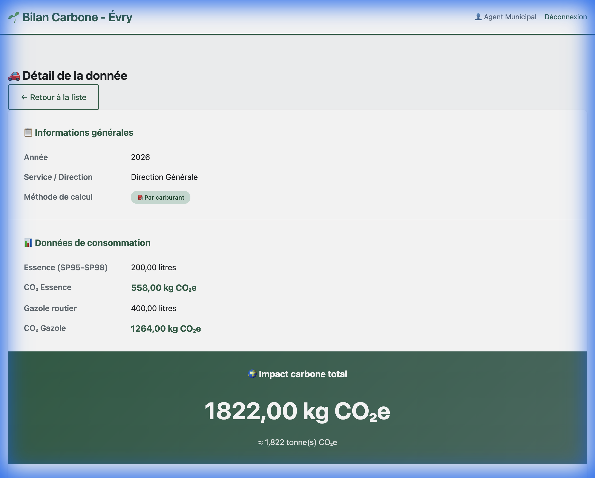

# 🎬 Démonstration - Bilan Carbone Évry

Démonstration complète de l'application de bilan carbone pour la Mairie d'Évry-Courcouronnes.

## 📋 Parcours utilisateur

Cette démonstration montre le processus complet de saisie des données véhicules, du login à la visualisation des résultats.

---

## 1️⃣ Dashboard - Vue d'ensemble

**Page d'accueil après connexion** avec :
- Accueil personnalisé "Bonjour Agent Municipal 👋"
- Statistiques globales :
  - 📊 Progression globale : 0%
  - 🚗 Véhicules : 0 donnée
  - ⚡ Facteurs ADEME : 4 facteurs chargés
- **Module Véhicules** actif avec boutons d'action
- Autres modules (Bâtiments, Alimentation, Achats) à venir

---

## 2️⃣ Formulaire vide - Saisie par carburant

**Interface de saisie** avec :
- Sélecteur de méthode : **⛽ Par carburant** ou 📏 Par distance
- Champs du formulaire :
  - Année (2026 par défaut)
  - Service / Direction
  - Consommation essence (litres)
  - Consommation gazole (litres)
  - Notes (optionnel)
- **Facteurs ADEME** affichés en bas :
  - Essence : 2.79 kg CO₂e/L
  - Gazole : 3.16 kg CO₂e/L

---

## 3️⃣ Formulaire rempli - Données saisies

**Exemple de saisie** :
- 📅 Année : **2026**
- 🏢 Service : **Direction Générale**
- ⛽ Essence : **200 litres**
- 🚛 Gazole : **400 litres**

Les **facteurs ADEME** sont clairement indiqués pour chaque type de carburant.

---

## 4️⃣ Liste des résultats - Impact calculé

**Tableau de bord des données** avec :
- 🌍 **Impact carbone total** : **1822,00 kg CO₂e** (≈ 2 tonnes CO₂e)
- Message de succès : "✅ Données enregistrées ! Impact carbone : 1822,00 kg CO₂e"
- Tableau récapitulatif :
  - Année : 2026
  - Service : Direction Générale
  - Méthode : ⛽ Carburant
  - Détails : Essence 200L + Gazole 400L
  - CO₂ : **1822,00 kg**
  - Date : 16/01/2026
- Actions disponibles : 👁️ Voir détails | 🗑️ Supprimer

**Informations utiles** affichées en bas :
- ✓ Par carburant : Saisissez vos consommations d'essence et/ou de gazole
- ✓ Par distance : Saisissez la distance totale parcourue
- ✓ Les calculs utilisent les **facteurs ADEME officiels** vérifiés en janvier 2026

---

## 5️⃣ Détail de la donnée - Calcul détaillé

**Vue détaillée de l'entrée** avec :

### 📋 Informations générales
- Année : **2026**
- Service : **Direction Générale**
- Méthode : ⛽ **Par carburant**

### 📊 Données de consommation
- **Essence (SP95-SP98)** : 200,00 litres
  - CO₂ Essence : **558,00 kg CO₂e**
- **Gazole routier** : 400,00 litres
  - CO₂ Gazole : **1264,00 kg CO₂e**

### 🌍 Impact carbone total
- **1822,00 kg CO₂e**
- ≈ **1.822 tonne(s) CO₂e**

---

## ✅ Validation des calculs

Les calculs sont **100% conformes aux facteurs ADEME** :

| Carburant | Quantité | Facteur ADEME | Calcul | Résultat |
|-----------|----------|---------------|--------|----------|
| Essence | 200 L | 2.79 kg CO₂e/L | 200 × 2.79 | **558 kg CO₂e** |
| Gazole | 400 L | 3.16 kg CO₂e/L | 400 × 3.16 | **1264 kg CO₂e** |
| **TOTAL** | | | 558 + 1264 | **1822 kg CO₂e** ✅ |

---

## 🎯 Fonctionnalités démontrées

- ✅ Authentification utilisateur
- ✅ Dashboard avec statistiques en temps réel
- ✅ Formulaire de saisie avec deux méthodes (carburant/distance)
- ✅ Validation des données
- ✅ **Calcul automatique du CO₂** avec facteurs ADEME
- ✅ Affichage de la liste avec total
- ✅ Vue détaillée avec répartition par type de carburant
- ✅ Interface responsive et éco-conçue
- ✅ Design moderne avec palette verte

---

## 🛠️ Stack Technique

- **Backend** : Django 6.0.1 + Python 3.12.11
- **Base de données** : SQLite (développement) / PostgreSQL (production)
- **Frontend** : Django Templates + Vanilla CSS
- **Facteurs d'émission** : ADEME Base Carbone® (janvier 2026)

---

**Application développée pour la Mairie d'Évry-Courcouronnes**  
Éco-conçue avec ❤️ pour la transition écologique 🌱
